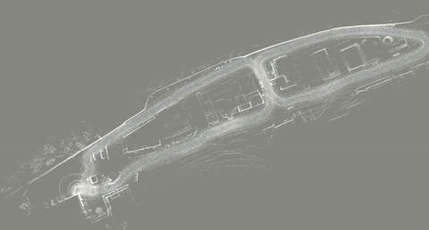
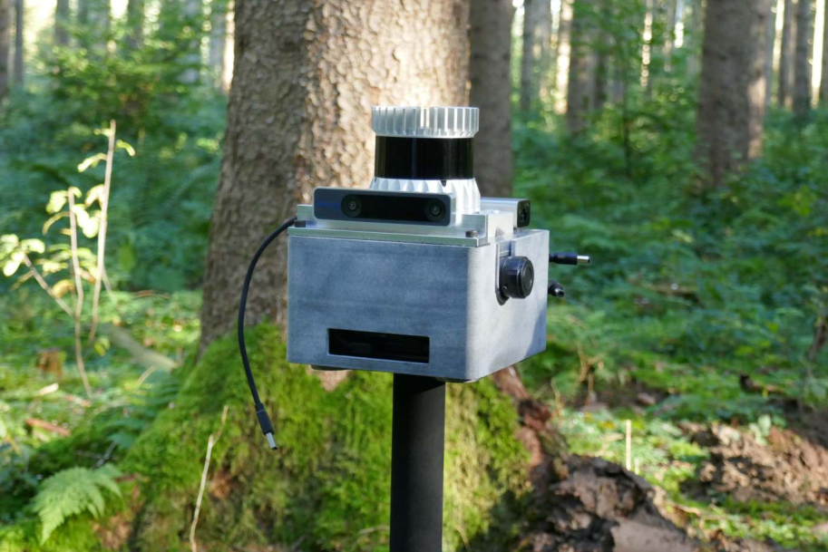
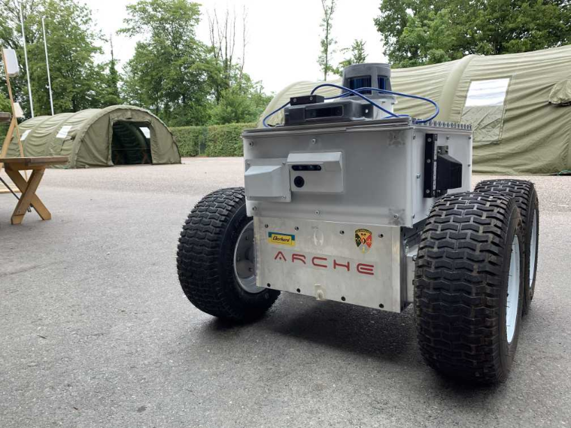
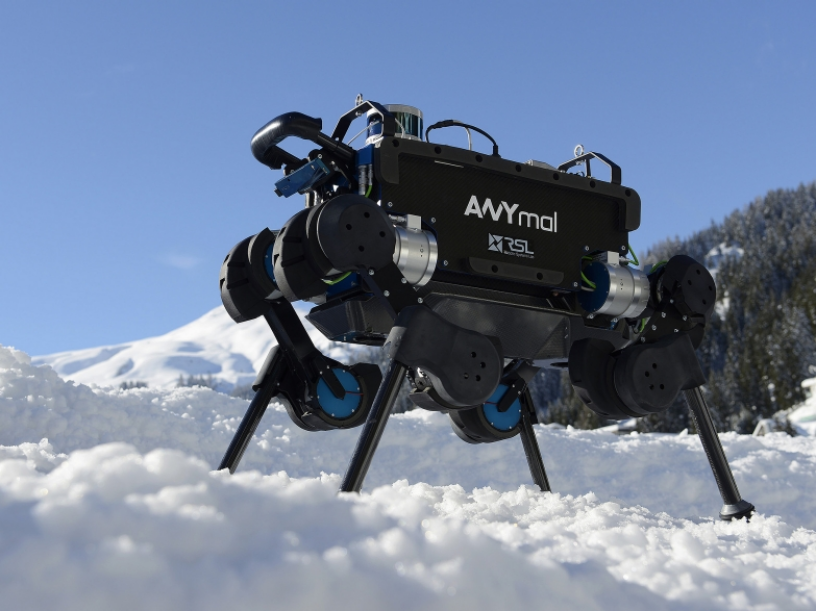
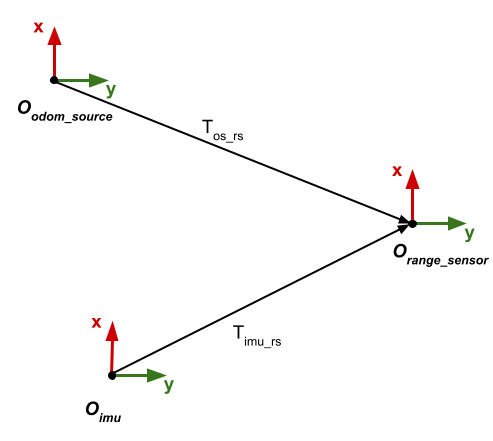

# Localization using ICP in a known map

## Overview

This package localizes the lidar sensor in a given map using the ICP algorithm. It subscribes to lidar scans and it registers them in a given map. If provided, it can use odometry or IMU to extrapolate the pose between the two iterations of ICP.

The user should provide a reference map (point cloud) as as a `.pcd` file and an initial pose in the reference map.

Released under [BSD 3-Clause license](LICENSE). Parts of the code in this repo have been inspired by the code inside google cartogrpaher. We've retained the copyright headers where applicable.

**Author:** Edo Jelavic

**Maintainer:** Edo Jelavic, [jelavice@ethz.ch](jelavice@ethz.ch)

| localization in a forest | localization in an urban environment |
|:--------:|------------------|
|[](doc/localization_forest.gif)|[](doc/localization_urban.gif)|


The package has been tested on the platforms shown in the images below. It has also been used during the ETH Robotic Summer School 2021
 ([link](https://robotics-summerschool.ethz.ch/)).  
 
| handheld sensor module | skid steer robot | legged robot |
|:--------:|------------------|--------------|
|[](doc/sensor_module.png)|[](doc/smb.png)|[](doc/anymal.png)|


## Installation

Clone the following three dependencies:
```bash
# in your source folder `src`
git clone https://github.com/leggedrobotics/icp_localization.git
git clone https://github.com/leggedrobotics/libnabo.git
git clone https://github.com/leggedrobotics/libpointmatcher.git
git clone https://github.com/leggedrobotics/pointmatcher-ros.git
```

Install ROS and library dependencies with:  
```bash
sudo apt install -y ros-noetic-pcl-ros ros-noetic-pcl-conversions ros-noetic-eigen-conversions ros-noetic-tf-conversions ros-noetic-tf2-ros libgoogle-glog-dev
# OR, use rosdep in your source folder `src` 
sudo rosdep install -yr --from-paths .
```

Recommended to build in release mode for performance (`catkin config -DCMAKE_BUILD_TYPE=Release`)

Build with:  
```bash
catkin build icp_localization
```

## Usage

This package is based on the `libpointmatcher` package and it uses the ICP implementation from there. Libpointmatcher has an extensive [documentation](https://libpointmatcher.readthedocs.io/en/latest/). icp_localization provides ROS wrappers and uses either odometry or IMU measurements to calculate initial guesses for the pointcloud alignment.

You can launch the program on the robot with: `roslaunch icp_localization icp_node.launch`. The `pcd_filepath` parameter in the launch file should point to the location where you stored your refrence map (pointcloud) in the `.pcd` format.

You can download the example bags and the example config files [here](https://drive.google.com/drive/folders/1XF3MUqT55m2beZYUe_IHQ4uhf6LF8m2J?usp=sharing). You can copy paste the rosbag and the map (`.pcd` file) to the `data` folder. Put the `.yaml` file in the config folder and you should be ready to run the forest environment example. For running the urban example, please adjust the parameters in the `icp_node_rosbag.launch` file. You need to chnage the `pcd_filename`, `input_filters_config_name`, `bag_filename` and the `parameter_filepath`.

The rosbag examples can be luaunched with:
```
roslaunch icp_localization icp_node_rosbag.launch
```

Note that the urban dataset uses the velodyne LIDAR whereas the forest dataset uses the ouster LIDAR. Please adjust the input_filters config file accordingly. Furthermore, in the forest dataset instead of full scans, each lidar packet is converted to pointcloud msg and then published.

The system has been tested with T265 tracking camera as an odometry source as well as legged odometry. If you are using the T265 make sure that you disable internal mapping and localization since it can cause pose jumps which will break the ICP.

The node also subscribes to the `/initialpose` topic and you can use rviz to set the initial pose of the range sensor. Note that this is not the initial robot pose since the range sensor coordinate frame might not coincide with the robot frame.

The node publishes the TF tree: map->odom->odom_source->range_sensor (in case you are using the odometry).

Try to see with rostopic list:
```
arghya@arghya-Erazer-X7849-MD60379:~/icp_localization_ws$ rostopic list
/camera/odom/sample
/clicked_point
/clock
/icp_node/assembled_scans
/icp_node/icp_map
/icp_node/range_sensor_pose
/icp_node/registered_cloud
/initialpose
/move_base_simple/goal
/rosout
/rosout_agg
/rslidar_points
/tf
/tf_static
/versavis/imu
```
Try to see with rosnode list:
```
arghya@arghya-Erazer-X7849-MD60379:~/icp_localization_ws$ rosnode list
/icp_node
/rosbag
/rosout
/rviz_icp
```
Try to see with rosnode info:
```
arghya@arghya-Erazer-X7849-MD60379:~/icp_localization_ws$ rosnode info /icp_node
--------------------------------------------------------------------------------
Node [/icp_node]
Publications: 
 * /icp_node/assembled_scans [sensor_msgs/PointCloud2]
 * /icp_node/icp_map [sensor_msgs/PointCloud2]
 * /icp_node/range_sensor_pose [geometry_msgs/PoseStamped]
 * /icp_node/registered_cloud [sensor_msgs/PointCloud2]
 * /rosout [rosgraph_msgs/Log]
 * /tf [tf2_msgs/TFMessage]

Subscriptions: 
 * /camera/odom/sample [nav_msgs/Odometry]
 * /clock [rosgraph_msgs/Clock]
 * /initialpose [geometry_msgs/PoseWithCovarianceStamped]
 * /rslidar_points [sensor_msgs/PointCloud2]
 * /tf [tf2_msgs/TFMessage]
 * /tf_static [tf2_msgs/TFMessage]
 * /versavis/imu [sensor_msgs/Imu]

Services: 
 * /icp_node/get_loggers
 * /icp_node/set_logger_level


contacting node http://arghya-Erazer-X7849-MD60379:46705/ ...
Pid: 26029
Connections:
 * topic: /rosout
    * to: /rosout
    * direction: outbound (57025 - 127.0.0.1:48478) [10]
    * transport: TCPROS
 * topic: /icp_node/icp_map
    * to: /rviz_icp
    * direction: outbound (57025 - 127.0.0.1:48482) [18]
    * transport: TCPROS
 * topic: /tf
    * to: /icp_node
    * direction: outbound
    * transport: INTRAPROCESS
 * topic: /tf
    * to: /rviz_icp
    * direction: outbound (57025 - 127.0.0.1:48480) [15]
    * transport: TCPROS
 * topic: /icp_node/registered_cloud
    * to: /rviz_icp
    * direction: outbound (57025 - 127.0.0.1:48486) [20]
    * transport: TCPROS
 * topic: /icp_node/range_sensor_pose
    * to: /rviz_icp
    * direction: outbound (57025 - 127.0.0.1:48484) [19]
    * transport: TCPROS
 * topic: /clock
    * to: /rosbag (http://arghya-Erazer-X7849-MD60379:38439/)
    * direction: inbound (46108 - arghya-Erazer-X7849-MD60379:46555) [11]
    * transport: TCPROS
 * topic: /tf
    * to: /icp_node (http://arghya-Erazer-X7849-MD60379:46705/)
    * direction: inbound
    * transport: INTRAPROCESS
 * topic: /tf_static
    * to: /rosbag (http://arghya-Erazer-X7849-MD60379:38439/)
    * direction: inbound (46116 - arghya-Erazer-X7849-MD60379:46555) [14]
    * transport: TCPROS
 * topic: /rslidar_points
    * to: /rosbag (http://arghya-Erazer-X7849-MD60379:38439/)
    * direction: inbound (46120 - arghya-Erazer-X7849-MD60379:46555) [22]
    * transport: TCPROS
 * topic: /camera/odom/sample
    * to: /rosbag (http://arghya-Erazer-X7849-MD60379:38439/)
    * direction: inbound (46126 - arghya-Erazer-X7849-MD60379:46555) [25]
    * transport: TCPROS
 * topic: /versavis/imu
    * to: /rosbag (http://arghya-Erazer-X7849-MD60379:38439/)
    * direction: inbound (46124 - arghya-Erazer-X7849-MD60379:46555) [24]
    * transport: TCPROS
 * topic: /initialpose
    * to: /rviz_icp (http://arghya-Erazer-X7849-MD60379:45837/)
    * direction: inbound (33564 - arghya-Erazer-X7849-MD60379:33879) [23]
    * transport: TCPROS

arghya@arghya-Erazer-X7849-MD60379:~/icp_localization_ws$ rostopic info /camera/odom/sample
Type: nav_msgs/Odometry

Publishers: 
 * /rosbag (http://arghya-Erazer-X7849-MD60379:38439/)

Subscribers: 
 * /icp_node (http://arghya-Erazer-X7849-MD60379:46705/)
 * /rviz_icp (http://arghya-Erazer-X7849-MD60379:45837/)
```

## Configuration

The configuration is split into three `.yaml` files.  

The `icp.yaml` file configures the ICP settings such as error metric and outlier filters. Any filter that is applied to the map can also be defined here.

The `input_filters.yaml` file configures operations that are applied to each scan of the range sensors. Subsampling, cropping and normal computation are configured in this file. Two examples have been provided (one for the velodyne puck range sensor and the other one for the ouste OS1 sensor).   

The filtering and the ICP can be configured by adding your own custom configuration `.yaml` files. Documentation on how to do that can be found [here](https://libpointmatcher.readthedocs.io/en/latest/Configuration/#creating-custom-configurations-with-yaml).  

The rest of the parameters is explained below:

* `icp_localization/initial_pose` - initial pose of the range sensor frame in the provided map.
* `icp_localization/imu_data_topic` - ROS topic on which the imu data is published
* `icp_localization/odometry_data_topic` - ROS topic on which the odometry data is published
* `icp_localization/num_accumulated_range_data` - Number of pointcloud messages that will be accumulated before trying to register them in a map. In case you are using full scans this parameter should be set to 1. In case you are publishing LIDAR packets, you need to convert them to sensor_msgs::Pointcloud2 first. At the moment there is no motion compensation implemented.
* `icp_localization/range_data_topic` - ROS topic on which the LIDAR data is published
* `icp_localization/is_use_odometry` - Whether to use odometry for initial pose prediction. If set the false, the pose extrapolator will try to use the imu data.
* `icp_localization/is_provide_odom_frame` - Whether to provide the odom frame or publish directly map to range sensor transformation only
* `icp_localization/gravity_vector_filter_time_constant` - Constant used for filtering imu measurements when estimating gravity. Smaller constant gives noisier estimates but adapts quicker to changes in orientation. Higher numbers give smoother estimates but take longer time to adapt to new orientation.
* `icp_localization/fixed_frame` - Fixed frame map. Used mostly for visualization.
* `icp_localization/min_num_odom_msgs_before_ready` - Ensure to have minimum number of msgs before starting ICP such that we can interpolate between them.
* `calibration` - calibration parameters between sensors. The coordinate frames are shown below. T<sub>os_rs</sub> is a transoformation from odometry source (e.g. tracking camera) to the range sensor frame.T<sub>imu_rs</sub> is the transformaion form the imu to the range sensor frame.



All coordinate frames follow the URDF convention: http://wiki.ros.org/urdf/XML/joint.


